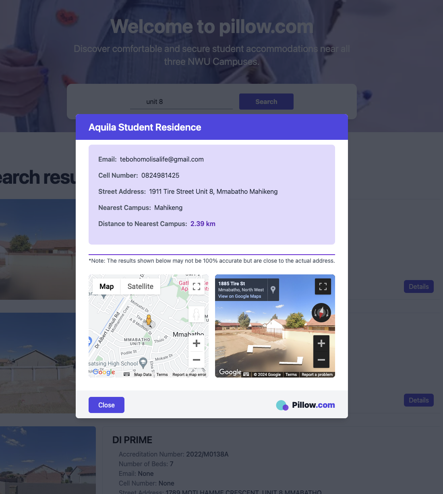

# Pillow.com: Simplifying Student Accommodation Search


## Purpose
Pillow.com is a web application designed to streamline the process of finding accredited student accommodations for students at all NWU campuses in South Africa. By providing a user-friendly platform, Pillow.com aims to simplify the search for accredited residences, aiding students funded by the National Student Financial Aid Scheme (NSFAS) in locating suitable accommodations.

## Team Members, Roles, and Timeline
Tshegofatso Seane (Backend Developer): Responsible for backend development, including building APIs, maintaining the database, and ensuring server-side functionality and efficiency.

Omphile Gopane (Frontend Developer): Handles frontend development, focusing on creating a responsive and intuitive user interface.

Timeline: The project is scheduled to be completed within a three-month timeframe, with regular milestones for development, testing, and deployment.

## Technologies Used
Backend: Django framework is chosen for its high-level abstractions, built-in features like ORM and authentication, and scalability.

Frontend: Standard web technologies (HTML, CSS, JavaScript) are utilized for building a responsive and user-friendly interface, prioritizing simplicity and accessibility.

## Challenges
One of the main challenges encountered during the development of Pillow.com is the intermittent lack of data returned by the Google Maps API. This inconsistency in data retrieval poses a significant obstacle, as it affects the accuracy and completeness of residence information displayed to users. Despite efforts to optimize API requests and handle edge cases, occasional instances of missing or incomplete data still arise, impacting the overall reliability of the platform. Addressing this challenge requires ongoing monitoring, fine-tuning of API usage, and implementing robust error-handling mechanisms to mitigate the impact on user experience.

## Features Completed:

1. Search and Filter Functionality: Pillow.com allows students to search for accredited accommodations based on various criteria such as location, rental price, amenities, and accreditation status. Students can filter search results to narrow down options and find accommodations that meet their specific requirements.
   


3. Detailed Residence Profiles: Each residence listing on Pillow.com includes comprehensive details such as address, contact information, bed capacity, rental price, amenities, and accreditation status. This information empowers students to make informed decisions about their living arrangements by providing them with all the necessary information at their fingertips.
   


## Installation
To install and set up the Pillow.com project locally, follow these steps:

1. Clone the repository to your local machine using the following command:

   ```bash
   git clone https://github.com/tshegofatsoseane/pillow.com.git

2. Navigate to the project directory:

   ```bash
   cd pillow.com

3. Install the project dependencies:

    ```bash
    pip install -r requirements.txt
    
4. Create a .env file in the project root directory and set up your environment variables.

5. Run database migrations to set up the database schema:

   ```bash
   python manage.py migrate

6. Start the development server:

   ```bash
   python manage.py runserver

7. Access the Pillow.com application in your web browser at http://localhost:8000.
   
## Usage
To use Pillow.com, follow these steps:

1. Navigate to the Pillow.com application in your web browser.

2. Explore the available features such as searching for accommodations, filtering search results, and viewing detailed residence profiles.


## Contributing
We welcome contributions from the community to help improve Pillow.com. If you'd like to contribute, please follow these guidelines:

1. Fork the repository on GitHub.

2. Make your desired changes in a new branch.

3. Ensure that your code follows the project's coding standards and conventions.

4. Test your changes thoroughly.

5. Submit a pull request with a clear description of your changes and why they are necessary.

